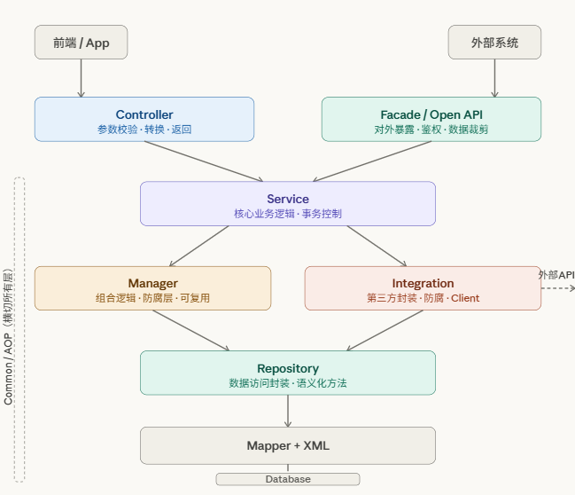
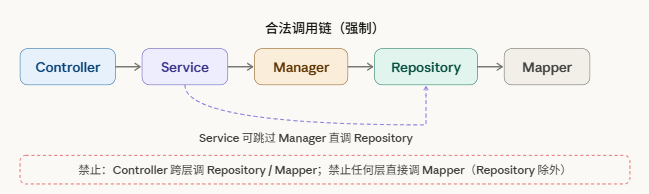

# 1. 架构选型背景 

本文档旨在说明新项目的代码架构选型决策。在正式设计之前，有必要梳理项目的现实约束条件，这些约束是架构选型的核心依据。 

## 1.1 项目现实约束

| **约束维度** | **现实情况**                      | **影响**                     |
| ------------ | --------------------------------- | ---------------------------- |
| 团队构成     | 团队人员技术水平参差不齐          | 需要低认知门槛的架构         |
| 人员稳定性   | 人员流动率较高                    | 需要低上手成本，文档化要求高 |
| 业务成熟度   | 业务需求尚未完全确定              | 架构需保持弹性，避免过度设计 |
| 历史教训     | 宣教项目引入 DDD ，实际落地为 MVC | 团队对 DDD 建模能力不足      |
| 交付压力     | 项目节奏快，追求快速落地          | 可落地性 > 架构先进性        |

## 1.2 **选型核心原则**

•     **可落地性优先**：团队能理解并实际执行的架构，比理论完美的架构更有价值

•     约定优于配置：通过**强规范**替代复杂的框架约束，降低学习成本

•     **渐进式演进**：结构上预留扩展点，业务稳定后可平滑升级

•     **文档即规范**：所有设计决策必须**文档化**，降低人员流动带来的知识断层风险

# 2. 分层架构核心概念 

分层架构（Layered Architecture）是软件工程中最经典、最广泛采用的架构模式之一。其核心思想是将系统按照职责边界垂直切分为若干层次，每一层只与相邻层交互，形成清晰的依赖关系。 

## 2.1 各层职责定义

| **层级**          | **职责**                                                | **禁止事项**                               |
| ----------------- | ------------------------------------------------------- | ------------------------------------------ |
| Controller        | 接收请求、参数校验（JSR-303）、调 Service、组装 VO 返回 | 禁止写业务逻辑；禁止直调 Mapper/Repository |
| Facade / Open API | 对外暴露接口、鉴权验证、数据边界裁剪                    | 禁止写业务逻辑；禁止直调数据库             |
| Service           | 核心业务逻辑、事务控制、业务规则校验                    | 禁止直调 Mapper；禁止写   SQL              |
| Manager           | 跨模块组合逻辑、第三方防腐层调用、可复用通用逻辑        | 禁止写 Controller 级别逻辑                 |
| Integration       | 封装第三方 HTTP 调用、统一异常转换、重试机制            | 禁止写业务判断逻辑                         |
| Repository        | 封装 Mapper 提供语义化数据访问方法                      | 禁止写业务判断逻辑                         |
| Mapper            | MyBatis 数据库操作接口                                  | 禁止被 Controller/Service 直接调用         |



## 2.2 合法调用链



Controller → Service → Manager → Integration(Service) → Integration(Client) → 第三方服务

External → Facade → Service → Manager → Repository → Mapper 

# 3. DDD vs 分层架构对比 

本章对 DDD 和分层架构进行客观对比，从多个维度分析两者的适用场景与权衡。 

| **对比维度** | **DDD** **领域驱动设计**                            | **分层架构（本方案）**           |
| ------------ | --------------------------------------------------- | -------------------------------- |
| 核心思想     | 以业务领域模型为中心，围绕 Bounded Context 组织代码 | 以技术职责分层，关注点清晰分离   |
| 适用场景     | 业务复杂度高、领域规则繁多、长期演进的核心系统      | 业务需求明确或尚在探索期的项目   |
| 团队要求     | 需要对领域建模有深刻理解，具备 DDD 实践经验         | 遵守分层规范即可，上手门槛低     |
| 落地难度     | 高：需要持续的领域专家协作和建模投入                | 低：规范清晰，外包团队可快速执行 |
| 代码组织     | 按业务领域（Bounded Context）组织，跨层较复杂       | 按技术层级组织，结构直观         |
| 人员交接     | 领域知识断层风险高，文档要求极高                    | 分层职责清晰，交接成本较低       |
| 演进能力     | 业务稳定后扩展性极强                                | 业务稳定后可平滑引入 DDD 思想    |

# 4. 选型决策：为什么选择分层架构 

## 4.1 DDD 落地失败的根因分析

上一个项目 DDD 落地失败的根本原因**并非 DDD 设计本身有问题**，而是**团队和项目现状不匹配**：

•     领域建模缺乏共识：团队成员对 **聚合根**（Aggregate Root）、**限界上下文**（Bounded Context ）等概念不理解，甚至缺乏DDD设计的基本了解和认识

•     业务未稳定过早建模：需求频繁变动导致领域模型反复推翻重建，成本极高

•     外包人员流动：领域知识随人员流失，后续接手者难以理解模型设计意图

•     最终回归 MVC：强行套用 DDD 包结构，**内部逻辑仍是 MVC 写法**，两头不讨好

## 4.2 本次选型决策矩阵

| **评估项**           | **权重** | **DDD** **得分** | **分层架构得分** |
| -------------------- | -------- | ---------------- | ---------------- |
| 团队可落地性         | 35%      | ★★☆☆☆            | ★★★★★            |
| 团队适配性           | 25%      | ★★☆☆☆            | ★★★★☆            |
| 业务不确定期适应能力 | 20%      | ★★☆☆☆            | ★★★☆☆            |
| 长期演进扩展性       | 10%      | ★★★★★            | ★★★☆☆            |
| 技术先进性           | 10%      | ★★★★★            | ★★★☆☆            |
| 综合加权得分         | 100%     | 2.6 / 5         | 3.95 / 5         |

## 4.3 最终结论

基于以上分析，项目选择「**规范化分层架构**」作为代码组织方式。这不意味着放弃架构思考，而是在**现实约束下做出务实的最优选择**。

*当项目业务趋于稳定、团队能力提升后，可在现有分层基础上逐步引入 DDD 中的核心思想（如领域对象充血模型、Repository 模式等）进行平滑演进，不需要推翻重来。*

# 5. 项目代码结构设计 

## 5.1 完整目录结构

```java

project-name/
├── src/main/java/com/company/project/
│   │
│   ├── config/                           # 配置类
│   │   ├── MybatisPlusConfig.java
│   │   ├── RedisConfig.java
│   │   └── WebMvcConfig.java
│   │
│   ├── common/                           # 公共组件（禁止放业务代码）
│   │   ├── result/
│   │   │   ├── Result.java               # 统一返回体
│   │   │   └── ResultCode.java           # 响应码枚举
│   │   ├── exception/
│   │   │   ├── BizException.java         # 业务异常
│   │   │   └── GlobalExceptionHandler.java
│   │   ├── aspect/                       # AOP 切面
│   │   │   ├── LogAspect.java
│   │   │   └── RepeatSubmitAspect.java
│   │   ├── annotation/                   # 自定义注解
│   │   │   ├── Log.java
│   │   │   └── RepeatSubmit.java
│   │   └── utils/
│   │       └── DateUtils.java
│   │
│   ├── domain/                           # 数据模型（纯 POJO，零业务逻辑）
│   │   ├── entity/                       # 数据库映射实体
│   │   │   └── UserEntity.java
│   │   ├── dto/                          # Service 层传输对象
│   │   │   ├── UserCreateDTO.java
│   │   │   └── UserQueryDTO.java
│   │   ├── vo/                           # Controller 层返回视图对象
│   │   │   └── UserVO.java
│   │   └── enums/                        # 业务枚举
│   │       └── UserStatusEnum.java
│   │
│   ├── controller/                       # 接口层
│   │   ├── UserController.java           # 对前端/App
│   │   └── open/                         # 对外部系统的 Open API
│   │       └── UserOpenController.java
│   │
│   ├── facade/                           # 对外暴露层（Facade 接口）
│   │   ├── UserFacade.java
│   │   └── impl/
│   │       └── UserFacadeImpl.java
│   │
│   ├── service/                          # 业务逻辑层
│   │   ├── UserService.java
│   │   └── impl/
│   │       └── UserServiceImpl.java
│   │
│   ├── manager/                          # 通用业务层（组合逻辑 / 防腐）
│   │   └── UserManager.java
│   │
│   ├── integration/                      # 第三方集成层
│   │   ├── wechat/
│   │   │   ├── WechatPayClient.java      # 封装 HTTP 调用
│   │   │   ├── WechatPayService.java     # 业务语义化封装
│   │   │   └── dto/
│   │   │       ├── WechatPayRequest.java
│   │   │       └── WechatPayResponse.java
│   │   └── sms/
│   │       ├── SmsClient.java
│   │       └── SmsService.java
│   │
│   ├── repository/                       # 数据访问封装层
│   │   ├── UserRepository.java
│   │   └── mapper/
│   │       └── UserMapper.java
│   │
│   └── ProjectApplication.java
│
├── src/main/resources/
│   │   ├── mapper/                           # XML SQL 文件
│   │   └── UserMapper.xml
│   ├── application.yml
│
└── src/test/                             # 单元测试（与主代码结构对应）

```

## 5.2 各层详细说明

链接wiki文档

# 6. 开发规范与落地保障 

架构落地的**核心挑战不在于设计，而在于执行**。本章节明确团队的开发规范，并给出可操作的落地保障机制。 

链接wiki文档

# 7. 其它架构方案对比 

| 架构方案            | 核心思想                     | 优点                         | 缺点                   | 适用场景                 | 本项目不选原因                      |
| ------------------- | ---------------------------- | ---------------------------- | ---------------------- | ------------------------ | ----------------------------------- |
| **分层架构**        | 按技术职责分层，控制依赖方向 | 易理解、易落地、团队适配性高 | 业务复杂后可能结构僵化 | 中小型系统、快速交付项目 | 已选方案                            |
| DDD（领域驱动设计） | 以领域模型为核心组织代码     | 适合复杂业务、扩展性强       | 建模难、落地成本高     | 核心业务复杂系统         | 团队缺乏建模经验，历史落地失败      |
| 整洁架构            | 依赖反转，业务核心独立       | 解耦彻底、可测试性强         | 抽象层多、理解成本高   | 高质量长期系统           | 当前业务复杂度不足，过度设计        |
| 六边形              | Ports + Adapters 解耦内外部  | 易扩展第三方、结构清晰       | 抽象复杂、学习成本高   | 多第三方接入系统         | 当前用 Manager + Integration 已满足 |
| **微服务架构**      | 拆分为多个独立服务           | 高扩展性、独立部署           | 运维复杂、分布式问题多 | 大规模系统               | Jalor框架支持                       |
| 事件驱动架构（EDA） | 基于事件进行解耦             | 高并发、异步解耦             | 调试困难、链路复杂     | 异步处理、高吞吐场景     | 当前业务以同步为主                  |
